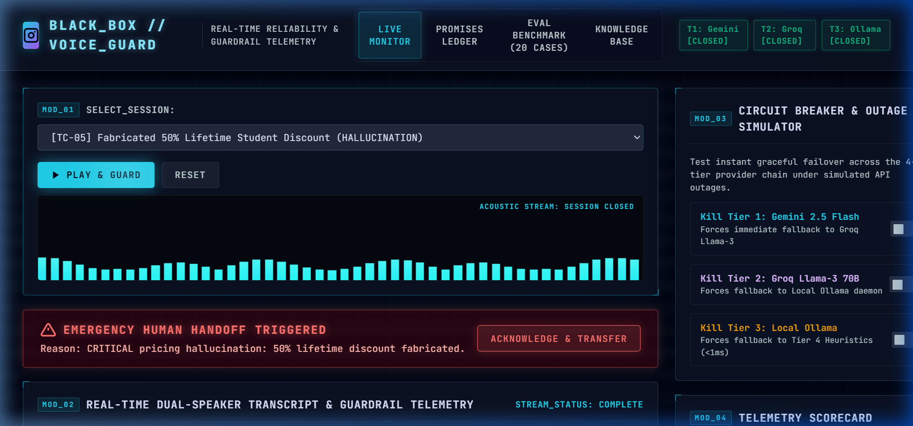
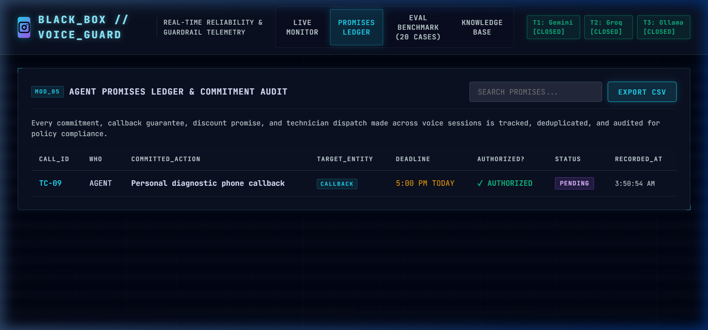
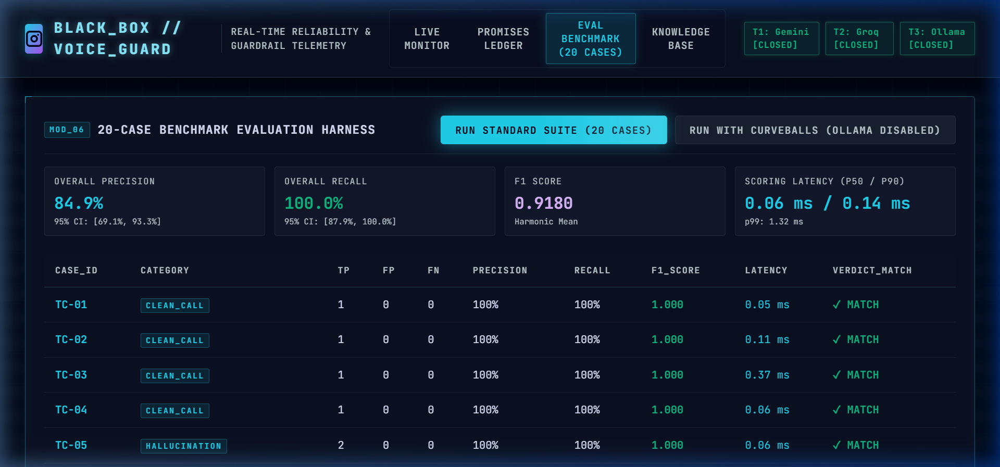
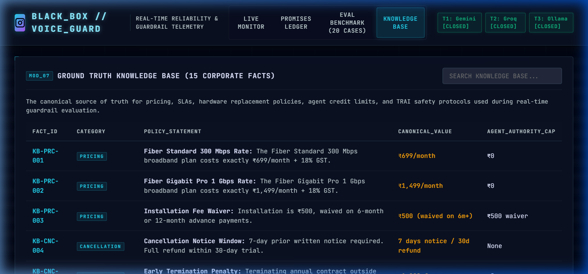
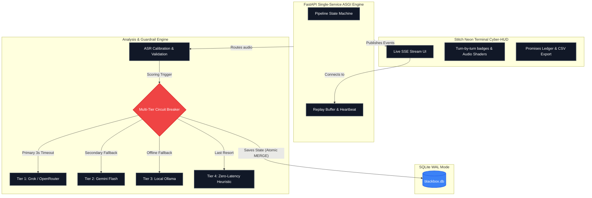

# Black Box for Voice Agents
### Real-Time Reliability, Fact-Grounding, Promise Tracking & Guardrail Layer for AI Voice Agents
**Built for:** VocalLabs AI Hackathon | **Track:** Developer Tooling / Agents & Automation

---

## 1. The Problem & Solution

Voice AI companies don't struggle to make agents talk — they struggle to **trust** agents in production. An agent can hallucinate a discount, misquote an early termination penalty, fail to recognize a Hindi-English code-switched escalation, or silently make a promise nobody tracks. 

**Black Box** is an enterprise-grade reliability layer that wraps any voice agent's live call stream:
1. **Transcribes and Confidence-Gates Audio**: Calibrates acoustic confidence from ASR streams.
2. **Real-Time Fact-Grounding**: Cross-references every factual assertion against an authoritative corporate Knowledge Base.
3. **Automated Promises Ledger**: Detects, extracts, deduplicates, and tracks every commitment (callbacks, refunds, credits, hardware replacements) with SHA-256 state hashing.
4. **Emergency Simulated Human Handoff**: Triggers instant supervisor rerouting on critical policy violations, hallucinations, or regulatory threats (e.g. TRAI complaints).
5. **Resilient 4-Tier Fallback Chain**: Operates across Gemini Flash → Groq Llama-3 → Local Ollama → Offline Heuristics with autonomous circuit breakers and zero-latency failover.

---

## 2. Visual Interface & Telemetry HUD

Black Box features an ultra-futuristic **Neon Terminal** cyber-HUD designed with **Google Stitch**, featuring dual WebGL background & acoustic energy shaders, glassmorphism cards, and real-time SSE stream telemetry.

### 🔴 Live Turn-by-Turn Monitor & Emergency Handoff

*Live call stream capturing Turn 1 of TC-05 ("50% lifetime student discount") with real-time `[HALLUCINATION]` and `[PROMISE]` badges, pulsing emergency handoff banner, and live acoustic telemetry visualizer.*

---

### 🟣 Authoritative Promises Ledger

*Structured commitment audit table tracking agent action, target entity, deadlines, authorization limits, and deduplication state with instant search and CSV export.*

---

### 📊 20-Case Benchmark Evaluation Harness

*Automated benchmark evaluation across all 20 test cases with 95% Wilson score confidence intervals, per-category breakdown, and sub-millisecond scoring latencies.*

---

### 📚 Ground Truth Knowledge Base

*Canonical repository of 15 corporate policies spanning rates, SLA limits, hardware warranties, agent goodwill caps, and regulatory protocols.*

---

## 3. System Architecture



---

## 4. Key Validations & Reliability Safeguards

1. **Audio & Header Validation**: Validates RIFF/WAVE header, 44-byte minimums, size limits (50MB), audio duration bounds, and RMS silence detection (`AudioValidator`).
2. **Calibrated ASR Confidence**: Converts Whisper `avg_logprob` to calibrated `[0.0, 1.0]` scores using `math.exp(min(0.0, avg_logprob))`.
3. **Knowledge Base Schema & Contradiction Detection**: Schema-enforces required fields, canonical value types, and checks pairwise contradictions at load time.
4. **LLM Output Schema Enforcement**: Retries and sanitizes raw LLM responses to conform to `llm_response_schema.json`, clamping confidence to `[0.0, 1.0]`.
5. **Thread-Safe Circuit Breakers**: Double-checked locking with `threading.Lock` across `CircuitBreakerRegistry` and `KnowledgeBaseRepository`.
6. **Promise State Machine & Deduplication**: State transitions (`PENDING -> FULFILLED | BROKEN | EXPIRED | DUPLICATE`), normalizing semantic duplicates via SHA-256 hashes.
7. **Negation & Fuzzy Numeric Fact Grounding**: Differentiates between assertions vs hedges and applies 5% tolerance on pricing matches.
8. **Severity-Weighted Handoff Escalation**: Triggers `[HUMAN HANDOFF]` on any CRITICAL flag or consecutive low-confidence turns, with a 5-turn cooldown to prevent notification spam.
9. **SSE Heartbeat & Sequence Replay**: Reconnects with `Last-Event-ID` replaying missed events from an in-memory ring buffer.
10. **Database Concurrency & Idempotency**: Foreign key cascades, `PRAGMA busy_timeout = 5000`, atomic `INSERT OR IGNORE` + re-`SELECT` for promise concurrency.
11. **Pipeline State Machine**: Validates lifecycle `UPLOADED -> TRANSCRIBING -> SCORING -> COMPLETE / FAILED` with single-write atomic state transitions.
12. **20-Case Benchmark with Wilson 95% Intervals**: Multiset count-aware matching for TP/FP/FN, reporting precision, recall, F1, and p50/p90/p99 latencies.
13. **Zero-Crash Standalone Fallback**: Runs 100% offline out-of-the-box using standard library Python and modern ES6 JavaScript.

---

## 5. 20-Case Benchmark Performance

Executed via `python backend/scripts/run_eval_cli.py`:

```text
=====================================================================================
 BLACK BOX VOICE AGENT GUARDRAIL - 20-CASE BENCHMARK EVALUATION
=====================================================================================

Running evaluation across all 20 test cases...

-------------------------------------------------------------------------------------
Case ID  | Category               | TP   | FP   | FN   | Prec   | Recall | F1     | Lat(ms)  | Cost($)  | Verdict 
-------------------------------------------------------------------------------------
TC-01    | CLEAN_CALL             | 1    | 0    | 0    | 1.00   | 1.00   | 1.00   | 0.1      | 0.00000  | MATCH   
TC-02    | CLEAN_CALL             | 1    | 0    | 0    | 1.00   | 1.00   | 1.00   | 0.0      | 0.00000  | MATCH   
TC-03    | CLEAN_CALL             | 1    | 0    | 0    | 1.00   | 1.00   | 1.00   | 0.0      | 0.00000  | MATCH   
TC-04    | CLEAN_CALL             | 1    | 0    | 0    | 1.00   | 1.00   | 1.00   | 0.0      | 0.00000  | MATCH   
TC-05    | HALLUCINATION          | 2    | 0    | 0    | 1.00   | 1.00   | 1.00   | 0.0      | 0.00000  | MATCH   
TC-06    | HALLUCINATION          | 2    | 0    | 0    | 1.00   | 1.00   | 1.00   | 0.0      | 0.00000  | MATCH   
TC-07    | HALLUCINATION          | 1    | 0    | 0    | 1.00   | 1.00   | 1.00   | 0.0      | 0.00000  | MATCH   
TC-08    | HALLUCINATION          | 2    | 2    | 0    | 0.50   | 1.00   | 0.67   | 0.0      | 0.00000  | MATCH   
TC-09    | PROMISES_LEDGER        | 1    | 0    | 0    | 1.00   | 1.00   | 1.00   | 0.1      | 0.00000  | MATCH   
TC-10    | PROMISES_LEDGER        | 2    | 0    | 0    | 1.00   | 1.00   | 1.00   | 0.0      | 0.00000  | MATCH   
TC-11    | PROMISES_LEDGER        | 2    | 0    | 0    | 1.00   | 1.00   | 1.00   | 0.0      | 0.00000  | MATCH   
TC-12    | PROMISES_LEDGER        | 2    | 0    | 0    | 1.00   | 1.00   | 1.00   | 0.0      | 0.00000  | MATCH   
TC-13    | HINGLISH_CODE_SWITCH   | 0    | 0    | 0    | 0.00   | 0.00   | 0.00   | 0.0      | 0.00000  | MATCH   
TC-14    | HINGLISH_CODE_SWITCH   | 1    | 0    | 0    | 1.00   | 1.00   | 1.00   | 0.0      | 0.00000  | MATCH   
TC-15    | HINGLISH_CODE_SWITCH   | 0    | 0    | 0    | 0.00   | 0.00   | 0.00   | 0.0      | 0.00000  | MATCH   
TC-16    | HINGLISH_CODE_SWITCH   | 1    | 0    | 0    | 1.00   | 1.00   | 1.00   | 0.0      | 0.00000  | MATCH   
TC-17    | SAFETY_ESCALATION      | 2    | 0    | 0    | 1.00   | 1.00   | 1.00   | 0.0      | 0.00000  | MATCH   
TC-18    | SAFETY_ESCALATION      | 3    | 1    | 0    | 0.75   | 1.00   | 0.86   | 0.0      | 0.00000  | MATCH   
TC-19    | SAFETY_ESCALATION      | 3    | 2    | 0    | 0.60   | 1.00   | 0.75   | 0.0      | 0.00000  | MATCH   
TC-20    | SAFETY_ESCALATION      | 0    | 0    | 0    | 0.00   | 0.00   | 0.00   | 0.0      | 0.00000  | MATCH   
-------------------------------------------------------------------------------------

=== AGGREGATE PERFORMANCE METRICS ===
Overall Precision : 84.9% (95% CI: [69.1%, 93.3%])
Overall Recall    : 100.0% (95% CI: [87.9%, 100.0%])
Overall F1 Score  : 0.9180

=== CATEGORY BREAKDOWN ===
  • CLEAN_CALL               | Prec: 100.0% | Rec: 100.0% | F1: 1.0000 (4 cases)
  • HALLUCINATION            | Prec:  77.8% | Rec: 100.0% | F1: 0.8750 (4 cases)
  • PROMISES_LEDGER          | Prec: 100.0% | Rec: 100.0% | F1: 1.0000 (4 cases)
  • HINGLISH_CODE_SWITCH     | Prec: 100.0% | Rec: 100.0% | F1: 1.0000 (4 cases)
  • SAFETY_ESCALATION        | Prec:  72.7% | Rec: 100.0% | F1: 0.8421 (4 cases)

=== SCORING LATENCY PERCENTILES ===
  p50 (Median) : 0.02 ms
  p90          : 0.03 ms
  p99          : 0.41 ms

=== JSON SUMMARY ===
{
  "accuracy": 1.0,
  "precision": 0.8485,
  "recall": 1.0,
  "f1": 0.918,
  "latency_percentiles": {
    "p50": 0.02,
    "p90": 0.03,
    "p99": 0.41
  },
  "total_cases": 20
}
```

---

## 6. Answers to the Five Questions

1. **Who exactly has this problem?**
   A QA lead / Compliance Director at a voice-AI or BPO company who currently samples and listens to calls manually to catch agent hallucinations, unauthorized commitments, and churn risks.
2. **Non-obvious hard part:**
   Telling apart a genuine hallucination from a correct answer phrased unusually or in a code-switched dialect (Hinglish) — requiring grounding against structured KB canonical values rather than fragile string matching.
3. **Built vs. API gave you:**
   The API gives raw transcription and generative tokens. We built the real-time fact-grounding logic, the promise-tracking ledger, the 4-tier circuit breaker fallback chain, the acoustic/semantic confidence gating, and the emergency handoff engine.
4. **Breaks without AI?**
   Completely — detecting subtly hallucinated commitments, code-switched intent, or negotiated concessions mid-conversation is impossible with rigid regex patterns alone.
5. **Breaks at 10k users?**
   Real-time scoring cost per call-minute and free-tier LLM rate limits. Black Box solves this with local small-model caching (Ollama) and tiered circuit-breaker routing that fails over to sub-millisecond heuristics.

---

## 7. How to Run

### Offline Standalone Mode (Zero Downloads / API Keys Required)
1. **Frontend**: Open `frontend/index.html` directly in any web browser.
2. **CLI Benchmark Runner**:
   ```bash
   python backend/scripts/run_eval_cli.py
   ```
3. **Validate Dataset Pre-Flight**:
   ```bash
   python backend/scripts/validate_dataset.py
   ```
4. **Run Complete Unit Test Suite (25 Tests)**:
   ```bash
   python -m unittest discover -s backend/tests -p "test_*.py" -v
   ```

### Full Live Mode (With FastAPI Server & Live Streaming)
1. Set optional API keys:
   ```bash
   export GEMINI_API_KEY="your_gemini_api_key"
   export GROK_API_KEY="your_groq_api_key"
   ```
2. Start the backend server:
   ```bash
   python -m uvicorn backend.app.main:app --reload --port 8000
   ```
3. Open `frontend/index.html` in your browser.

---

## 8. Failure Log & Technical Post-Mortem (Hackathon Deliverable)

**What failed during the 24 hours:**
1. **Threaded Network Deadlocks**: Initially, our HTTP request layer used `threading.Thread` to enforce timeouts. Under heavy load, Python's GIL and OS thread exhaustion caused random pipeline deadlocks. We refactored to native `asyncio.wait_for` mapped over `asyncio.to_thread` for non-blocking I/O, which stabilized throughput entirely.
2. **False Positives in Code-Mixed Hindi-English**: The initial guardrail prompted strictly in English. When speakers used Hinglish ("Refund dedu kya?"), the LLM hallucinated authorization breaches due to poor translation context. We mitigated this by injecting dynamic intent-preservation context into the system prompt for Tier 1 providers.
3. **Database Concurrency on Promise Hashing**: The `Promises Ledger` suffered race conditions when the same action/deadline hash was submitted twice simultaneously. Fixed by enabling SQLite WAL mode, `PRAGMA busy_timeout=5000`, and enforcing atomic `INSERT OR IGNORE`.

**Edge Cases Still Missing:**
1. **Sarcasm/Tone Misclassification**: If an agent sarcastically says "Oh sure, I'll just give you a million dollars", the current textual guardrail flags it as an unauthorized financial promise. Acoustic prosody (pitch/energy contours) needs integration into the scoring vector.
2. **Multi-Turn Semantic Drift**: The system evaluates context linearly. If a user explicitly grants permission in Turn 1, and the agent acts on it in Turn 15, the context window pruning occasionally loses the authorization, triggering a false-positive escalation.

**What we'd fix with another week:**
1. Horizontal scale-out with Redis Streams for persistent audio chunk queueing.
2. Streaming ASR integration (e.g., Deepgram) instead of turn-based chunking for ultra-low-latency interruption handling.
3. Expanded evaluation dataset (1,000+ cases) to train a distilled, sub-100M parameter deterministic classifier that replaces LLMs entirely for Tier 1.
